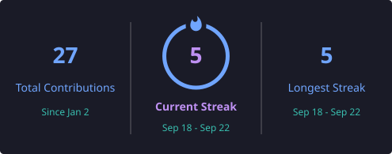
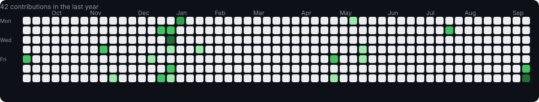

# 👋 Hi, I'm Shantanu Kumar

### Software Engineer • Full-Stack Developer • Backend Enthusiast

  
  

  <b>☕ Java</b> • <b>⚙️ Spring Boot</b> • <b>💻 .NET</b> • <b>🌐 Angular</b> • <b>⚛️ React</b> • <b>🗄️ SQL</b> • <b>☁️ AWS</b>

  <i>Turning ideas into production-ready software — and bugs into features.</i>

---

## 👨‍💻 About Me

- 💼 **Programmer Analyst at Cognizant**, working on full-stack .NET applications
- 🚀 Building practical software with **C#, ASP.NET Core, Angular, SQL and REST APIs**
- ☕ Strong interest in **Java, Spring Boot, backend engineering and DSA**
- 🏗️ Experience building REST APIs, database-backed applications and full-stack systems
- 🤖 Currently learning **Generative AI, LLMs and AI Agents**
- 🧠 Interested in **system design, microservices, cloud and scalable backend architecture**
- 📫 **Email:** [kumar23shantanu543@gmail.com](mailto:kumar23shantanu543@gmail.com)

---

## 💼 Experience

### 🏢 Cognizant — Programmer Analyst
**Full-Stack .NET Development**

Working on enterprise full-stack applications using:

`C#` `ASP.NET Core` `Angular` `SQL` `REST APIs`

### 🚀 ManuPlan — Software Development Intern

Contributing to production software and working across application development, backend functionality, APIs and database-driven features.

---

# 🚀 Featured Projects

<table>
<tr>
<td width="50%">

### ♻️ Smart Waste Management

A smart waste-management and reward platform designed to encourage responsible waste disposal through a reward-based system.

**Tech:** `React` `Spring Boot` `MySQL` `REST APIs`

</td>

<td width="50%">

### 📇 Smart Contact Management

A full-stack contact management platform with REST APIs, database integration and a modern web interface.

**Tech:** `Java` `Spring Boot` `MySQL` `JavaScript` `Tailwind CSS`

</td>
</tr>
</table>

---

# 🧠 Currently Learning

---

# 🛠️ Tech Stack

### Languages

  

### Backend & Frameworks

  

### Frontend

  

### Databases & Cloud

  

### DevOps & Tools

  

---

# 📊 GitHub Analytics

  
  

---

# 🔥 Contribution Streak

  

---

# 📈 Contribution Activity

  

---

# 🐍 Contribution Snake

  <picture>
    <source media="(prefers-color-scheme: dark)" srcset="./profile/github-contribution-grid-snake-dark.svg">
    <source media="(prefers-color-scheme: light)" srcset="./profile/github-contribution-grid-snake.svg">
    
  </picture>

---

# 🏆 GitHub Profile

---

# 🤝 Connect

---

### 💭 Building. Learning. Breaking. Fixing. Repeating.

<i>One commit at a time. 🚀</i>

